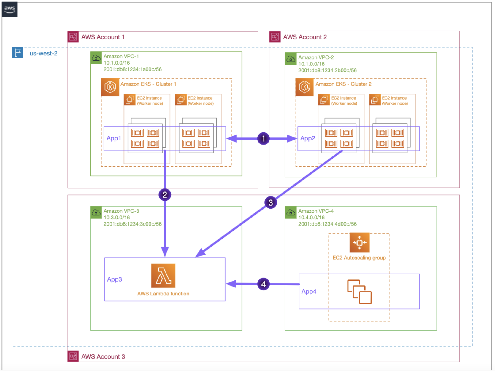
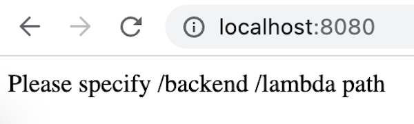
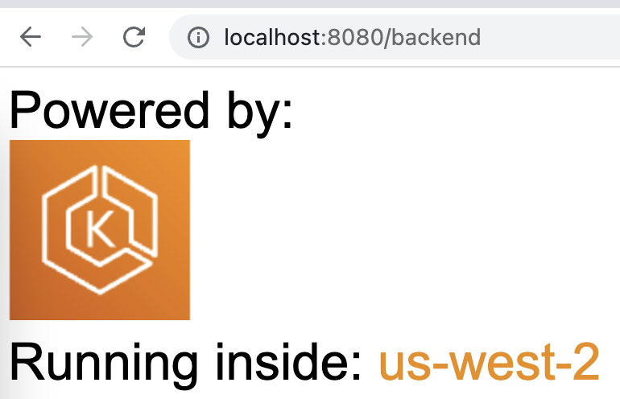
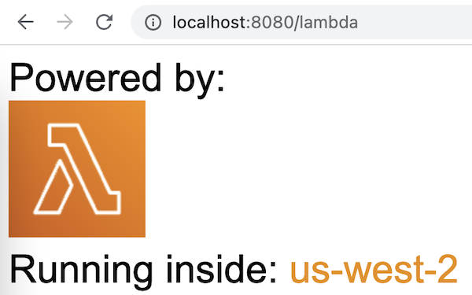

# Amazon VPC Lattice - Build secure multi-account multi-VPC connectivity for your applications

This repository contains example code to deploy a service to service communication using [Amazon VPC Lattice](https://aws.amazon.com/vpc/lattice/). You will find several applications hosted in [Amazon EKS](https://aws.amazon.com/eks/), [AWS Lambda](https://aws.amazon.com/lambda/), and an [Auto Scaling group](https://docs.aws.amazon.com/autoscaling/ec2/userguide/auto-scaling-groups.html). You will connect them using VPC Lattice following this setup:



## Prerequisites

* AWS Account(s) with IAM user(s) with appropriate permissions. The deployment instructions are agnostic to single or multiple AWS Account - follow the pattern you like to test.
* [AWS CLI](https://aws.amazon.com/cli/) installed - for the deployment of VPC Lattice resources and applications using [AWS CloudFormation](https://aws.amazon.com/cloudformation/).
* `eksctl` and `kubectl` installed - for the deployment of EKS applications.
* Remember to use an AWS Region where VPC Lattice is supported.

## Deployment

Before start with the deployment, let's define some variables we'll use during the deployment:

```bash 
export AWS_REGION=us-west-2
export SERVICE_NETWORK_NAME=service-network
export CLUSTER1_NAME=cluster1
export CLUSTER2_NAME=cluster2
```

### Create Amazon VPC Lattice Service Network

First things first, we create the Service Network - central piece in our service-to-service communication. We have this resource defined in the [lattice-service-network](./vpc-lattice/lattice-service-network.yaml) file, so the only thing we need is deploy that AWS CloudFormation template:

```bash
aws cloudformation deploy --stack-name service-network --template-file ./vpc-lattice/lattice-service-network.yaml --region $AWS_REGION --parameter-overrides ServiceNetworkName=$SERVICE_NETWORK_NAME  --capabilities CAPABILITY_IAM --no-fail-on-empty-changeset
```

### Create the application hosted in the Auto Scaling group

With our Service Network ready, now it's time to deploy the different applications - we start with the one hosted in the Auto Scaling group. In the [app-asg](./applications/app-asg.yaml) file you will find the definition of the application and the network resources, plus the VPC association to the Service Network - we'll need to obtain the Service Network ID from the output of the previous CloudFormation stack.

```bash
export SERVICE_NETWORK_ID=$(aws cloudformation describe-stacks --stack-name service-network --query 'Stacks[0].Outputs[?OutputKey == `ServiceNetworkID`].OutputValue' --output text --region $AWS_REGION)

aws cloudformation deploy --stack-name asg-application --template-file ./applications/app-asg.yaml --region $AWS_REGION --parameter-overrides ServiceNetwork=$SERVICE_NETWORK_ID --capabilities CAPABILITY_IAM --no-fail-on-empty-changeset
```

### Create the application hosted in the AWS Lambda function

Next application is the one hosted in the Lambda function. You will find the definition of the resources in the [app-lambda](./applications/app-lambda.yaml) file. You will see that in addition to the Lambda function, resources for a VPC to place the Lambda are also created. As in our example, the Lambda function is only consumed, we are giving you all the resources needed in case you want also to consume any other application from the function itself.

```bash
aws cloudformation deploy --stack-name lambda-application --template-file ./applications/app-lambda.yaml --region $AWS_REGION --capabilities CAPABILITY_IAM --no-fail-on-empty-changeset
```

### Create EKS applications and deploy the AWS Gateway API controller

Now we need to create two Amazon EKS clusters using `eksctl`. Remember that the names of those clusters were already defined at the beginning:

```bash
eksctl create cluster $CLUSTER1_NAME --region=$AWS_REGION --enable-ssm=true --node-private-networking=true
aws eks update-kubeconfig --name $CLUSTER1_NAME --alias cluster1

eksctl create cluster $CLUSTER2_NAME --region=$AWS_REGION --enable-ssm=true --node-private-networking=true
aws eks update-kubeconfig --name $CLUSTER2_NAME --alias cluster2
```

Once we are our clusters deployed, is time to **deploy the Gateway API controller**. The first step is to create an IAM policy (you fill find its definition in the [recommended-inline-policy.json](./vpc-lattice/controller/recommended-inline-policy.json) file) that can invoke the gateway API. Once we have it created, we export its ARN - as we will need it later.

```bash
aws iam create-policy \
--policy-name VPCLatticeControllerIAMPolicy \
--policy-document file://vpc-lattice/controller/recommended-inline-policy.json

export VPCLatticeControllerIAMPolicyArn=$(aws iam list-policies --query 'Policies[?PolicyName==`VPCLatticeControllerIAMPolicy`].Arn' --output text)
```

Also, we will need to update the Security Groups use by our clusters to receive traffic from the VPC Lattice fleet. To simplify this configuration, we will make use of the VPC Lattice [managed prefix list](https://docs.aws.amazon.com/vpc/latest/userguide/managed-prefix-lists.html) - make sure you use the prefix list ID of the AWS Region you are using. Before configuring this entry in the Security Groups, let's get the CIDR blocks from the managed prefix list. See [Control traffic to resources using security groups](https://docs.aws.amazon.com/vpc/latest/userguide/VPC_SecurityGroups.html) for more information.

```bash
export MANAGED_PREFIX=$(aws ec2 get-managed-prefix-list-entries --region $AWS_REGION --prefix-list-id pl-0721453c7ac4ec009  | jq -r '.Entries[0].Cidr')
```

Time to deploy the gateway controller. Let's start with **cluster1**. We'll perform the following actions:

* Obtain the Security Group used by the cluster and update it allowing the traffic to the VPC Lattice CIDR block (information obtained above).
* Create the `system` namespace.
* Create an `iamserviceaccount` for pod level permission.
* Deploy the VPC Lattice Controller.
* Create the `amazon-vpc-lattice` GatewayClass.

```bash
kubectl config use-context cluster1

export CLUSTER1_SG=$(aws eks describe-cluster --name $CLUSTER1_NAME | jq -r '.cluster.resourcesVpcConfig.clusterSecurityGroupId')
aws ec2 authorize-security-group-ingress --group-id $CLUSTER1_SG --cidr $MANAGED_PREFIX --protocol -1

kubectl apply -f ./vpc-lattice/controller/deploy-namesystem.yaml

eksctl utils associate-iam-oidc-provider --region=${AWS_REGION} --cluster=${CLUSTER1_NAME} --approve
eksctl create iamserviceaccount \
    --cluster=${CLUSTER1_NAME} \
    --namespace=system \
    --name=gateway-api-controller \
    --attach-policy-arn=${VPCLatticeControllerIAMPolicyArn} \
    --override-existing-serviceaccounts \
    --region ${AWS_REGION} \
    --approve

kubectl apply -f ./vpc-lattice/controller/deploy-resources.yaml
kubectl apply -f ./vpc-lattice/controller/gatewayclass.yaml
```

We proceed the same, but now with **cluster2**:

```bash
kubectl config use-context cluster2

export CLUSTER2_SG=$(aws eks describe-cluster --name $CLUSTER2_NAME | jq -r '.cluster.resourcesVpcConfig.clusterSecurityGroupId')
aws ec2 authorize-security-group-ingress --group-id $CLUSTER2_SG --cidr $MANAGED_PREFIX --protocol -1

kubectl apply -f ./vpc-lattice/controller/deploy-namesystem.yaml

eksctl utils associate-iam-oidc-provider --region=${AWS_REGION} --cluster=${CLUSTER2_NAME} --approve
eksctl create iamserviceaccount \
    --cluster=${CLUSTER2_NAME} \
    --namespace=system \
    --name=gateway-api-controller \
    --attach-policy-arn=${VPCLatticeControllerIAMPolicyArn} \
    --override-existing-serviceaccounts \
    --region ${AWS_REGION} \
    --approve

kubectl apply -f ./vpc-lattice/controller/deploy-resources.yaml
kubectl apply -f ./vpc-lattice/controller/gatewayclass.yaml
```

With this, it's time to create the EKS applications. However, before that, let's deploy the VPC Lattice Services - as we will need some of their domain names to configure these applications.

### Create VPC Lattice Services

As we have a mix of technologies for our applications, we are going to create the VPC Lattice Services (and listeners) using CloudFormation, while the different target groups will be created either using CloudFormation or `kubectl`. Let's start with the Lattice Services. You will find the definition of the resources in the [lattice-services.yaml](./vpc-lattice/lattice-services.yaml) file.

```bash
aws cloudformation deploy --stack-name lattice-services --template-file ./vpc-lattice/lattice-services.yaml --region $AWS_REGION --parameter-overrides ServiceNetwork=$SERVICE_NETWORK_ID --capabilities CAPABILITY_IAM --no-fail-on-empty-changeset
```

### Create EKS "frontend" and "backend" applications

Now that we have the Lattice Services created (still without routing configuration) now we can point to the one we need in our EKS applications. Add the Service3 domain name inside the [back-end.yaml](./applications/apps-eks/kubernetes/back-end.yaml) and [front-end.yaml](./applications/apps-eks/kubernetes/front-end.yaml) files. Now we're ready to deploy the `frontend` and `backend` applications:

```bash
kubectl config use-context cluster1
kubectl apply -f ./applications/apps-eks/kubernetes/front-end.yaml

kubectl config use-context cluster2
kubectl apply -f ./applications/apps-eks/kubernetes/back-end.yaml
```

### Create VPC Lattice Target Groups and routing

We have our applications ready, and VPC Lattice Service Network and Services deployed, it's time to create all the routing to communicate our applications. Let's start creating the target groups:

* We will export both the `frontend` and `backend` applications to make them available as VPC Lattice targets.
* We will create the Lambda and AutoScaling group targets using CloudFormation.
* We will associate the VPC where the EKS clusters are located to the Service Network using CloudFormation.
* And finally, we will create all the routing configuration using CloudFormation.

```bash
kubectl config use-context cluster1
kubectl apply -f ./vpc-lattice/routes/frontend-export.yaml

kubectl config use-context cluster2
kubectl apply -f ./vpc-lattice/

export LambdaArn=$(aws cloudformation describe-stacks --stack-name lambda-application --query 'Stacks[0].Outputs[?OutputKey == `LambdaArn`].OutputValue' --output text --region $AWS_REGION)
export ASGVpcId=$(aws cloudformation describe-stacks --stack-name asg-application --query 'Stacks[0].Outputs[?OutputKey == `VpcId`].OutputValue' --output text --region $AWS_REGION)
export InstanceID1=$(aws cloudformation describe-stacks --stack-name asg-application --query 'Stacks[0].Outputs[?OutputKey == `InstanceID1`].OutputValue' --output text --region $AWS_REGION)
export InstanceID2=$(aws cloudformation describe-stacks --stack-name asg-application --query 'Stacks[0].Outputs[?OutputKey == `InstanceID2`].OutputValue' --output text --region $AWS_REGION)

aws cloudformation deploy --stack-name lattice-targets --template-file ./vpc-lattice/lattice-targetgroups-lambda-asg.yaml --region $AWS_REGION --parameter-overrides ServiceNetwork=$SERVICE_NETWORK_ID LambdaArn=$LambdaArn ASGVpcId=$ASGVpcId InstanceID1=$InstanceID1 InstanceID2=$InstanceID2 --capabilities CAPABILITY_IAM --no-fail-on-empty-changeset

export Cluster1VpcID=$(aws ec2 describe-vpcs --filters Name=tag:Name,Values=eksctl-$CLUSTER1_NAME-cluster/VPC --region $AWS_REGION | jq -r '.Vpcs[0].VpcId')
export Cluster2VpcID=$(aws ec2 describe-vpcs --filters Name=tag:Name,Values=eksctl-$CLUSTER2_NAME-cluster/VPC --region $AWS_REGION | jq -r '.Vpcs[0].VpcId')

aws cloudformation deploy --stack-name lattice-eks-vpc-associations --template-file ./applications/eks-vpc-associations.yaml --region $AWS_REGION --parameter-overrides Cluster1VpcID=$Cluster1VpcID Cluster1SG=$CLUSTER1_SG Cluster2VpcID=$Cluster2VpcID Cluster2SG=$CLUSTER2_SG ServiceNetwork=$SERVICE_NETWORK_ID --capabilities CAPABILITY_IAM --no-fail-on-empty-changeset

export SERVICE1=$(aws cloudformation describe-stacks --stack-name lattice-services --query 'Stacks[0].Outputs[?OutputKey == `Service1`].OutputValue' --output text --region $AWS_REGION)
export SERVICE2=$(aws cloudformation describe-stacks --stack-name lattice-services --query 'Stacks[0].Outputs[?OutputKey == `Service2`].OutputValue' --output text --region $AWS_REGION)
export SERVICE3=$(aws cloudformation describe-stacks --stack-name lattice-services --query 'Stacks[0].Outputs[?OutputKey == `Service3`].OutputValue' --output text --region $AWS_REGION)
export SERVICE4=$(aws cloudformation describe-stacks --stack-name lattice-services --query 'Stacks[0].Outputs[?OutputKey == `Service4`].OutputValue' --output text --region $AWS_REGION)
export TARGETCLUSTER1=arn:aws:vpc-lattice:us-west-2:225963075789:targetgroup/tg-032600d2e013a5b85
export TARGETCLUSTER2=arn:aws:vpc-lattice:us-west-2:225963075789:targetgroup/tg-07b330d93afe85f0a
export TARGETLAMBDA=$(aws cloudformation describe-stacks --stack-name lattice-targets --query 'Stacks[0].Outputs[?OutputKey == `LatticeLambdaTarget`].OutputValue' --output text --region $AWS_REGION)
export TARGETASG=$(aws cloudformation describe-stacks --stack-name lattice-targets --query 'Stacks[0].Outputs[?OutputKey == `LatticeASGTarget`].OutputValue' --output text --region $AWS_REGION)

aws cloudformation deploy --stack-name lattice-routing --template-file ./vpc-lattice/lattice-routes.yaml --region $AWS_REGION --parameter-overrides Service1=$SERVICE1 Service2=$SERVICE2 Service3=$SERVICE3 Service4=$SERVICE4 TargetGroupCluster1=$TARGETCLUSTER1 TargetGroupCluster2=$TARGETCLUSTER2 TargetGroupLambda=$TARGETLAMBDA TargetGroupASG=$TARGETASG --capabilities CAPABILITY_IAM --no-fail-on-empty-changeset
```

## Testing Connectivity

Everything is created! Now we have all our applications either consuming or providing its services via VPC Lattice. So it's time to check that we can indeed consume those applications.

Let's start checking if **frontend (cluster1) can consume both backend (cluster2) and the Lambda function**. Port-forward the frontend application (so it will be visible in your browswer as localhost:8080):

```
kubectl config use-context cluster1
kubectl port-forward svc/frontend 8080:80
```



If you use the path */backend*, we are calling Service2 (which is the *backend* application hosted in *cluster2*). The *backend* application will also consume Service3 (Lambda function) to retrieve the AWS Region where the application is located. You will see in your browser the following:



* Both EKS Clusters are talking to each other using VPC Lattice - more specifically *cluster1* to *cluster2* - using Service2. 
* In addition, EKS cluster2 is talking to the Lambda function using Service3.

If you use the path */lambda*, we are calling Service3 (which is the Lambda function). You will see in your browser the following:



* EKS cluster1 is talking directly to the Lambda function using VPC Lattice Service3.

Now, let's check if **the Auto Scaling group can consume the Lambda function**. Go to the EC2 console, select any of the *web-server-instance* EC2 instances, and click *Connect*. Connect to the EC2 instance using Session Manager, and perform the following tests (check Service3's domain name either by using the CLI or in the AWS management console):

```bash
dig {SERVICE 3 DOMAIN NAME}
curl {SERVICE 3 DOMAIN NAME}
```

When doing the *dig* command, you should receive a link-local address from the VPC (so the request to the service will be forwarded to Lattice). If when applying the *curl* command you get the AWS Region you are working on, the connection to the Lambda function using VPC Lattice is working as expected.

## Clean-up

* Delete Amazon VPC Lattice routes, target groups (Lambda and AutoScaling group), services, and VPC associations using CloudFormation

```bash
aws cloudformation delete-stack --stack-name lattice-routing --region $AWS_REGION
aws cloudformation delete-stack --stack-name lattice-eks-vpc-associations --region $AWS_REGION
aws cloudformation delete-stack --stack-name lattice-targets --region $AWS_REGION
aws cloudformation delete-stack --stack-name lattice-services --region $AWS_REGION
```

* Delete VPC Lattice resources created using EKS.

```bash 
kubectl delete -f vpc-lattice/routes
kubectl delete -f vpc-lattice/controller/gatewayclass.yaml
kubectl delete -f vpc-lattice/controller/deploy-resources.yaml #use helm if you have used the helm installation steps!
eksctl delete iamserviceaccount --name=gateway-api-controller --cluster=${CLUSTER1_NAME} --region=${AWS_REGION} --namespace=system
eksctl delete iamserviceaccount --name=gateway-api-controller --cluster=${CLUSTER1_NAME} --region=${AWS_REGION} --namespace=system
aws iam delete-policy --policy-arn ${VPCLatticeControllerIAMPolicyArn}
```

* Delete all the applications - cluster1 and cluster2 via `eksclt` and the Lambda function and Auto Scaling group via CloudFormation

```bash
eksctl delete cluster --name=${CLUSTER1_NAME} --region=${AWS_REGION}
eksctl delete cluster --name=${CLUSTER2_NAME} --region=${AWS_REGION}
aws cloudformation delete-stack --stack-name lambda-application --region $AWS_REGION
aws cloudformation delete-stack --stack-name asg-application --region $AWS_REGION
```

* Delete VPC Lattice Service Network

```bash
aws cloudformation service-network --stack-name asg-application --region $AWS_REGION
```

## References

* [Introducing Amazon VPC Lattice](https://d1.awsstatic.com/events/Summits/reinvent2022/NET215_NEW-LAUNCH!-Introducing-Amazon-VPC-Lattice-Simplifying-application-networking.pdf).

## Security

See [CONTRIBUTING](CONTRIBUTING.md#security-issue-notifications) for more information.

## License

This library is licensed under the MIT-0 License. See the LICENSE file.